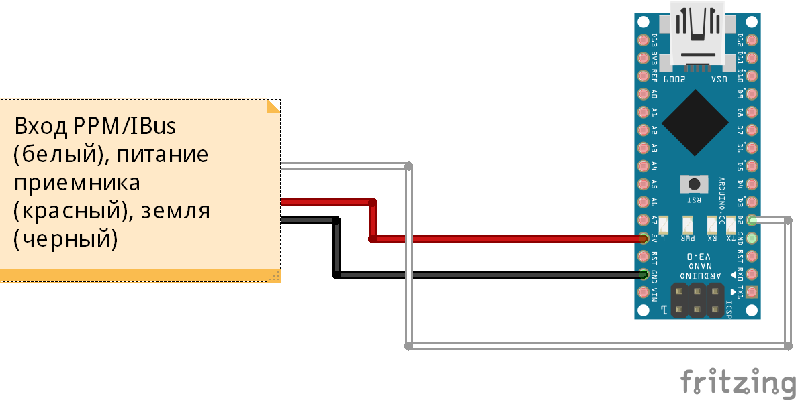

# RCSimulatorDongle_V3

# Оглавление

  * [Описание проекта](#Description)
  * [Описание папок в репозитории](#Folders_description)
  * [Компоненты и материалы](#Components)
  * [Схема подключения](#Scheme)
  * [FAQ](#FAQ)
  

## Описание проекта
#### *Что это?*
Еще один способ подключения аппаратуры радиоуправления к симулятору.

#### *История* 
Это уже 3 способ после самодельного симуляторного пульта и симуляторного переходника с PPM, преимущества этого варианта - меньше лагов, точнее обработка, возможность работы со всеми известными мне симуляторами. Недостатки - проблемы с установкой виртуального джойстика на ОС x64.

#### *Что дальше?*
Симуляторный шнурок на Ардуино Уно REV3 для любой ОС и любого симулятора с поддержкой нескольких протоколов радиоаппаратуры.

## Описание папок в репозитории
  - **FlySkyIBus_modifiedByMrTransistor** - требуемая для компиляции прошивки библиотека - закинуть в C://Program Files/Arduino/libraries
  - **RCSimulatorDongle_V3** - код прошивки
  - **PPJoy** - архив с виртуальным джойстиком, устанавливается с помощью Setup.exe внутри папки
  - **Остальное - файл, который вы сейчас читаете и картинка из его начала**

## Материалы и компоненты
  - [Arduino NANO](http://ali.pub/20o36t)
  - Приемник аппаратуры Flysky - **[FS-iA6B!!!](http://ali.pub/1exhys)**
  - Провода для Ардуино или 3-проводной шлейф - можно поискать на Алиэкспрессе
  

## Схема подключения

## FAQ
### Основные вопросы
В: Как скачать с этого сайта?  
О: На главной странице проекта (где ты читаешь этот текст) вверху справа зелёная кнопка **Clone or download**, вот её жми, там будет **Download ZIP**

В: Скачался какой то файл .zip, куда его теперь?  
О: Это архив. Можно открыть стандартными средствами Windows, но думаю у всех на компьютере установлен WinRAR, или, на крайний случай, 7-zip, архив нужно правой кнопкой и извлечь.

В: Я совсем новичок! Что мне делать с Ардуиной, где взять все программы?  
О: Читай и смотри видосы, например, [тут](http://alexgyver.ru/arduino-first/)

В: Компьютер никак не реагирует на подключение Ардуины!  
О: Возможно у тебя зарядный USB кабель, а нужен именно data-кабель, по которому можно данные передавать  
О: Если у тебя китайская Ардуино, то для нее надо поставить драйвера, гугли "Драйвера CH340G" или сразу лезь [сюда](http://smart-chip.ru/drajver-dlya-arduino/)

В: Ошибка! Скетч не компилируется!  
О: Проверь, правильно ли выбрана плата, порт.  
О: Иногда встречается такое "Путь к скетчу не должен содержать кириллицу. Положи его в корень диска", но сам такого не замечал, хотя все скетчи храню на флешке, весь путь к ним на кириллице.  
О: Если ошибка "converting to execution character set", или что-то похожее, то нажми кнопку "Сохранить" и перепрошей. Если опять не получается сохрани скетч в другом месте с помощью "Сохранить как..."

В: Сколько стоит?  
О: Ничего не продаю, а по отдельности зависит от уровня инфляции в стране и мест покупки комплектующих)))

